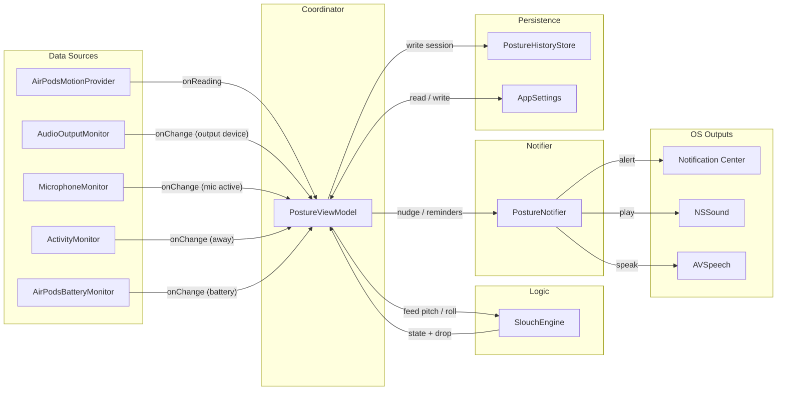

# NoSlouch

A dependency-free macOS 14+ menu-bar app for desk posture and ergonomics. It reads AirPods head-motion data to detect slouching and nudges you to sit up, layers in wellness reminders (breaks, eye-rest, hydration, movement), tracks daily streaks, grades, and a weekly digest, shows AirPods battery, and stays quiet while you are on a call or away from your desk.

## Features

- Detects slouching via AirPods headphone motion (CoreMotion pitch angle)
- Dynamic menu-bar icon that reflects posture state (upright / slouching / snoozed)
- Visual posture-deviation gauge in the popover, with a baseline-to-limit progress bar
- Customizable alert threshold, hold time, and recovery time
- Audible nudges with a named system-sound picker and preview, plus optional speech alerts
- Snooze nudges for 15 / 30 / 60 minutes, independent of the automatic pause
- **Mute in meetings**: automatically pauses all alerts while your microphone is active (uses CoreAudio hardware state, so no microphone-permission prompt)
- **Wellness reminders**: stretch breaks plus eye-rest, hydration, and movement, on configurable intervals with a global minimum gap (no stacking) and **quiet hours**
- **Idle/away auto-pause** (opt-in): freezes tracking and silences nudges when you lock the screen or step away
- **Escalating** and **custom** nudge messages
- **Sensitivity presets** (Gentle / Standard / Strict) and optional **head-tilt detection**
- **Daily upright goal** with current/longest **streaks**, a **posture grade + achievements**, and a **weekly digest**
- **AirPods battery** widget (Left / Right / Case) with an optional low-battery warning
- Opt-in **auto-drift** baseline recalibration and a recalibration reminder
- **CSV export** of history; hourly history retained for intraday insight
- First-run **onboarding** window
- Live 60-second deviation chart with a gradient fill that tracks posture state
- Session stat cards: upright time, slouch count, today's upright score, and session count
- Posture history window: 30-day upright-share bar chart and per-day rows
- Launch at login toggle
- 90-day session history stored locally
- No external dependencies; pure Swift

## Requirements

- macOS 14.0+
- AirPods (3rd gen / Pro / Max) or Beats Fit Pro for live head-motion data
- Developer ID certificate for signed builds with the `com.apple.developer.coremotion.headphone-motion-data` entitlement; ad-hoc builds work for local development but cannot receive AirPods motion data

## Build and run

```bash
make run          # build + bundle + open the app
make bundle       # build + assemble NoSlouch.app with ad-hoc codesign
make build        # swift build only
make test         # run the test suite
make lint         # check formatting
make format       # auto-fix formatting
make clean        # remove .build/ and NoSlouch.app
```

All `swift build` and `swift test` calls require `--disable-sandbox`, which the Makefile applies automatically.

## Architecture

The entry point is `NoSlouchApp.swift`. All coordination flows through `PostureViewModel`, the single `@StateObject` owned by the app.



Key components:

| File | Role |
|---|---|
| `SlouchEngine.swift` | Pure struct; maps pitch (and optional roll) samples to `SlouchState` (unknown/good/bad) |
| `PostureViewModel.swift` | Coordinates all subsystems; owns cooldown, snooze, mute, reminders, away-pause, auto-drift, and session-stat logic |
| `PostureNotifier.swift` | Fires posture nudges and `ReminderKind` reminders (notification, sound, speech), plus low-battery notice |
| `ReminderKind.swift` | Reminder taxonomy (break / eye-rest / hydration / movement) + per-kind copy |
| `AudioOutputMonitor.swift` | Tracks the active audio output device and exposes its name (is an AirPod the output?) |
| `MicrophoneMonitor.swift` | Tracks default-input "running" state to drive mute-in-meetings (no mic permission needed) |
| `ActivityMonitor.swift` | Screen-lock/sleep + HID-idle "away" detection (public APIs) for idle auto-pause |
| `AirPodsBatteryMonitor.swift` | Reads AirPods/Beats battery via `system_profiler SPBluetoothDataType` (polls every 300 s; unavailable under sandbox) |
| `AirPodsMotionProvider.swift` | Streams headphone motion data from CoreMotion |
| `AppSettings.swift` | Persists user preferences to UserDefaults |
| `DetectionPreset.swift` | Gentle/Standard/Strict sensitivity presets (pure) |
| `PostureHistoryStore.swift` | Aggregates sessions into daily + hourly records; 90-day cap; `exportCSV()` |
| `StreakCalculator.swift` | Pure current/longest daily-goal streak calculator |
| `PostureGrade.swift` | Pure letter grade + achievements evaluator |
| `WeeklyDigest.swift` | Pure weekly-summary string |
| `PostureSession.swift` | Model for a single session (bad/good seconds, slouch events) |
| `PostureChartView.swift` | 60-second sliding deviation chart (gradient area + line) using Swift Charts |
| `HistoryView.swift` | History window: 30-day bar chart, per-day rows, streaks, grade, weekly digest, CSV export |
| `MenuBarView.swift` | Popover UI: status, deviation gauge, stat cards, chart, snooze, mute + battery widgets, actions |
| `OnboardingView.swift` | First-run setup window |
| `SettingsView.swift` | Settings window (Cmd+,): all AppSettings fields |

## Milestones

### M1 - Settings/Preferences UI (done)

Dedicated Settings window (Cmd+,) exposing all `AppSettings` fields. The menu-bar popover was slimmed to status and primary actions only.

### M2 - UX improvements (done)

- Deviation value in notification body: "Your head dropped N below your baseline."
- Device name in connection status: shows "AirPods Pro connected" instead of generic "Ready".
- Launch at login via `SMAppService`.

### M3 - Richer session stats (done)

Per-session `goodSeconds` and `slouchEvents` tracked alongside `badSeconds`. All three are shown as live tile stats in the popover and persisted to `PostureHistoryStore`.

### M4 - Live chart and sound picker (done)

- 60-second sliding pitch/deviation chart rendered with `Charts.LineMark` and a dashed `RuleMark` at the alert threshold.
- Named system sound picker (Funk, Glass, Ping, etc.) with a preview button, replacing the plain sound on/off toggle.

### M5 - History, dynamic icon, snooze, daily score (done)

- Posture History window (`HistoryView`): a 30-day upright-share bar chart plus per-day rows, backed by the existing `PostureHistoryStore`.
- Dynamic menu-bar icon: the `MenuBarExtra` symbol reflects posture state (upright / slouching / snoozed-or-paused).
- Snooze nudges for 15/30/60 minutes from the menu, independent of the automatic 3-strikes pause and not cleared by good posture.
- Today's upright score ("Today: N% upright · M slouches") shown in the menu whether or not a session is active.
- Robustness fixes: no notification prompt on launch (status is refreshed, not requested), the active session is flushed on app termination, and the paused-status text is derived from the pause-duration constant.

### M6 - Meetings, breaks, and dashboard aesthetics (done)

- Mute in meetings: `MicrophoneMonitor` watches the default input's hardware "running" state and, when on, suppresses all alerts while the mic is active. Bad-posture nudges return early; break reminders are deferred (not dropped) until the mic frees up.
- Stretch break reminders: a configurable interval (`breakReminderMinutes`) of accumulated monitored time triggers a "time to stretch" reminder.
- Dashboard aesthetics: a posture-deviation gauge, a grid of session stat cards, and a gradient `AreaMark` under the live chart that follows posture state.
- Settings: toggles for mute-in-meetings and break reminders, plus a break-interval stepper.

### M7 - Polish, wellness, and insights (done)

- Snooze/auto-pause status shows a live remaining-time countdown.
- Reminder engine unified into `ReminderKind` (break / eye-rest / hydration / movement) with a global minimum gap and quiet hours.
- Idle/away auto-pause via `ActivityMonitor` (opt-in); escalating and custom nudge messages.
- Sensitivity presets and optional head-tilt detection; opt-in auto-drift baseline recalibration and a recalibration reminder.
- Daily upright goal + streaks, posture grade + achievements, weekly digest, and CSV export (hourly history retained).
- AirPods battery widget with optional low-battery warning; first-run onboarding window.

## Testing

```bash
make test
swift test --disable-sandbox --filter SlouchEngineTests
swift test --disable-sandbox --filter SlouchEngineTests/testSustainedDropBecomesBad
```

Tests use fakes for hardware dependencies (`FakeHeadMotionProvider`, `FakeAudioOutputMonitor`, `FakeMicrophoneMonitor`, `FakeActivityMonitor`, `FakeAirPodsBatteryMonitor`, `FakePostureNotifier`) and isolated UUID-named `UserDefaults` suites to prevent cross-test contamination.

## License

See [LICENSE](LICENSE).
